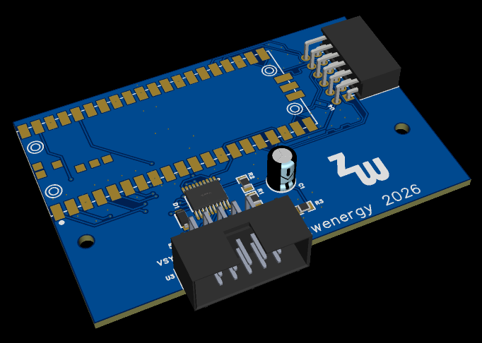
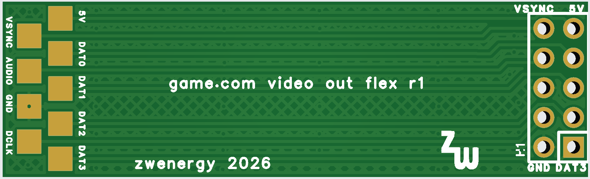
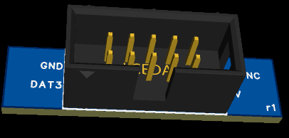
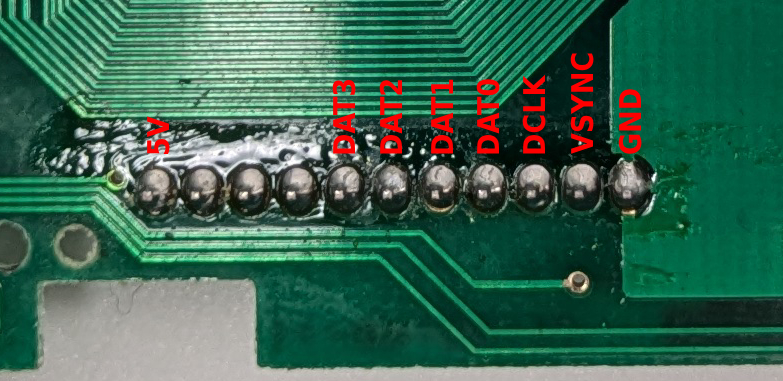
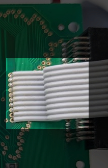

# game.video
A video out adapter for the Tiger game.com handheld.

# This is a work in progress, expect things not being polished and not fully documented!

## General Overview
This project taps in the digital video signals of the Tiger game.com handheld as well as the analog audio (unfortunately, no digital audio is available as the Sharp SM8521 microcontroller has an integrated DAC for audio) and breaks them out to a 10 pin IDC connector.
This connector is placed in the upper cart slot of the handheld to make a complete no-cut mod (note that it only uses the space of the empty cart slot, no connections to the actual cart connector is done here).
A small video out adapter is then connected via an IDC cable which outputs digital video and audio at 720p@60 Hz.

## Hardware Pieces
The project makes use of 3 custom PCBs.
### Video Adapter PCB

This adapter board receives the signals via the 10 pin IDC cable and outputs digital video + audio to the PMOD DVI board.
In order to use the 3D printed shell, the PCB should be ordered with 1.6 mm width.

_**BOM**_

| **Reference** | **Value**| **Links**
|---------------|----------|----------|
| U1 | Raspberry Pi Pico 2 (**not** with pre-soldered pin header) ||
| U2 | TI TXB0108PWR |[LCSC](https://www.lcsc.com/product-detail/C53406.html)|
| U3 | 10 pin IDC connector header 90° angle |[LCSC](https://www.lcsc.com/product-detail/C5372873.html)|
| U4 | 2x 6 pin pin 2.54 mm pitch 90° angle female connector ("PMOD") |[LCSC](https://www.lcsc.com/product-detail/C2897426.html)|
| R1, R2 | 100 kOhm resistor (0805) |[LCSC](https://www.lcsc.com/product-detail/C96346.html)|
| R3 | 33 kOhm resistor (0805) |[LCSC](https://www.lcsc.com/product-detail/C17633.html)|
| D1 | Schottky Diode (SOD-123FL) |[LCSC](https://www.lcsc.com/product-detail/C891416.html)|
| C1 | 10 uF capacitor through-hole ||
| | PMOD DVI/HDMI adapter|[AliExpress](https://de.aliexpress.com/item/1005010041828932.html)|

### Flex PCB

The display and audio signals are soldered via wires to the pads of the flex PCB.
It slides into the cart slot and connects to the IDC connector board.
Make sure to order as a flex PCB.

### Connector PCB

The connector PCB is soldered to the flex PCB and held in place with a 3D printed bracket.
The PCB should be ordered with 1.6 mm width.

_**BOM**_

| **Reference** | **Value**| **Links**
|---------------|----------|----------|
| P1 | 10 pin IDC connector header|[LCSC](https://www.lcsc.com/product-detail/C5665.html)|

## Installation
**WARNING & BEWARE:**
The game.com is a marvellous piece of engineering, so there's a ton of different screws at all kinds of weird places.
Make sure to remember which screw goes where.
Besides, the touch screen connector flex cable is only partially glued down to the motheboard and somewhat given pressure by the display bracket.
That glue has mostly disintegrated 30 years later, so be very careful when handling the display.

**All that to say: Be careful when disassembling a game.com, you can easily break stuff or mix screws up or other bad things.
This thing has a bad production quality in the first place.
<ins>Everything is done at your own risk.</ins>**

**Also, this still is a work-in-progress! Any additional feedback or installation photos/guides are very welcome!**

Prepare the flex cable + connector PCB combo.
For this solder the IDC connector on the PCB and the flex cable on the back of it.
The PCB shows the supposed orientation of the IDC connector (the notch is marked).
Make sure to align the flex cable also in the correct orientation (check the the signal names + positions on the flex line up with the signal names + positions on the connector PCB).

Disassemble the Tiger game.com to the point where you can remove the motherboard from the shell and access the back of the motherboard.
Be careful when opening the shell, as the speaker is stuck to the front part of the shell and hard-wired.
Also be careful when taking out the motherboard from the bottom shell, as the battery contacts are stuck to the bottom and shell and hard-wired to the motherboard.
8 out of the 9 signals to be wired to the flex cable pads are connected to the display signal pin headers.
Wire the signals from the following points to the corresponding pads on the flex cable (try to make the wires as short as possible, but keep in mind where there flex cable is situated so that you can still nicely route the wires when placing back the motherboard into the shell).

The audio pad on the flex cable has to be wired up to the same solder point of the headphone connector where the **blue** wire of the headphone connector is connected to (_**INSERT A PHOTO HERE**_).
Make sure to keep all the existing flimsy connections for the headphone connector intact.

Wrap the part of the flex cable with the solder pads from both sides with kapton or electrical kape to make sure no short-circuits can happen.
Place the connector PCB into the 3D printed bracket.
Now place the motherboard back into the bottom shell and align the video connector combo into the upper cart slot (**under** the right-hand controller sub-PCB).
Carefully re-insert the "cart slot cover", making sure everything still fits and screw in place.
During the step, the additional flex cable length can be carefully folded in the empty cart slot and/or placed under the controller sub-PCB's ribbon cable.

_**INSERT FURTHER INSTALL STEPS HERE**_

## Disclaimer
**Use the files and/or schematics to build your own board at your own risk**.
This project works fine for me, but it's a simple hobby project, so there is no liability for errors in the schematics and/or board files.
**Use at your own risk**.
